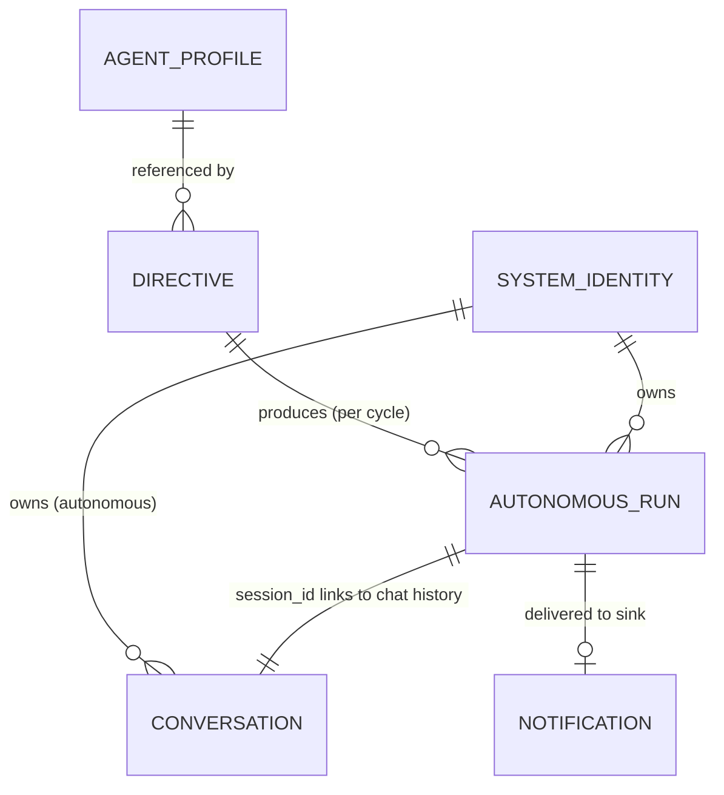

# Phase 1 Data Model: Autonomous Mode

## Entities

### Directive (configuration, not persisted to Cosmos)

A standing order defining one unit of autonomous work. Loaded from `config/autonomous.yaml`.

| Field | Type | Required | Notes |
|-------|------|----------|-------|
| `id` | string | yes | Stable, unguessable-not-required identifier (e.g., `duty-officer-watch`). Used as the Cosmos partition key for run records. |
| `profile_id` | string | yes | References an existing `agents.yaml` profile (e.g., `chief-of-staff`). |
| `instruction` | string | yes | The natural-language standing prompt the agent executes each cycle. |
| `schedule` | string | no | NCRONTAB (6-field, seconds-first). Drives the in-process scheduler; omit to exclude a directive from the schedule (still runnable via run-now). |
| `enabled` | bool | no (default `true`) | Per-directive enable flag. |
| `notify` | object | no | `{ webhook: <url-or-env-var-name> }`. If absent, the global webhook (if any) applies; else LoggingSink only. |

**Validation rules**:
- `id`, `profile_id`, `instruction` are non-empty strings.
- `profile_id` SHOULD resolve to a known profile; if it does not, a cycle for that directive
  fails cleanly and records a failed run (FR + edge case "profile no longer exists").
- Duplicate `id`s are rejected at load time.
- Global gate: the feature is active only if `enabled: true` at the top level (or env
  `AUTONOMOUS_ENABLED=true`) **and** the directive's own `enabled` is true.

**Global config fields** (top of `config/autonomous.yaml`):
| Field | Type | Notes |
|-------|------|-------|
| `enabled` | bool | Master switch (env `AUTONOMOUS_ENABLED` overrides). |
| `system_user_id` | string | Owner identity for autonomous data (default `autonomous-duty-officer`; env `AUTONOMOUS_USER_ID` overrides). |
| `directives` | list[Directive] | One or more directives. |

---

### AutonomousRunRecord (persisted: Cosmos `autonomous-runs`, partition `/directive_id`)

One execution of a directive — the audit record.

| Field | Type | Notes |
|-------|------|-------|
| `id` | string | Unique run id (uuid4 hex). Cosmos item id. |
| `directive_id` | string | Partition key. The directive that ran. |
| `profile_id` | string | Agent profile used. |
| `session_id` | string | The conversation/session id created for this cycle (links to chat history). |
| `status` | string enum | `success` \| `failure`. |
| `started_at` | string (ISO-8601 UTC) | Cycle start. |
| `finished_at` | string (ISO-8601 UTC) | Cycle end. |
| `response_text` | string | The agent's final response (may be truncated for storage sanity, full text in history). |
| `tool_events` | list[object] | Tools/actions invoked (name, arguments, result) — same shape as eval traces. |
| `usage` | object | `{ input_token_count, output_token_count, total_token_count }`. |
| `error` | string \| null | Failure reason when `status=failure`; else null. |
| `notify_status` | string enum | `logged` \| `delivered` \| `skipped` \| `failed`. |
| `notify_error` | string \| null | Delivery error if `notify_status=failed`; else null. |
| `trigger` | string enum | `timer` \| `manual` — how the cycle was initiated. |
| `doc_type` | string | Constant `"autonomous_run"`. |
| `schema_version` | int | Constant `1`. |

**Serialization**: `to_doc()` / `from_doc()` (Cosmos) and `to_wire()` (API response, camelCase
keys) mirroring the existing `ConversationRecord` pattern. Secrets MUST NOT appear in any
field (webhook URLs/keys are referenced by env-var name in config, never copied into records).

**State transitions**:
```
[start cycle] → started_at set, status implicitly pending (not yet written)
   ├─ agent completes → status=success, response/tool_events/usage captured
   │      └─ notify → notify_status in {logged, delivered, skipped, failed}
   └─ agent/dependency errors → status=failure, error captured
   → finished_at set → single upsert to Cosmos (atomic per record)
```
A record is written **once** at cycle end (or on caught failure), never partially — satisfying
FR-016 (no inconsistent half-written audit state).

---

### AutonomousRunResult (in-memory return value of `run_autonomous_cycle`)

The structured result returned to the API layer and used to build the API response. Carries
the same fields as `AutonomousRunRecord` plus convenience accessors; not separately persisted.

---

### SchedulerLease (persisted: Cosmos `autonomous-leases`, partition `/directive_id`)

A short-lived claim the in-process scheduler creates to guarantee at-most-once execution of a
scheduled slot across all backend instances.

| Field | Type | Notes |
|-------|------|-------|
| `id` | string | `"{directive_id}:{slot}"` — the slot is the most-recent due fire time (ISO-8601). Cosmos item id; the atomic-create on this id IS the lock. |
| `directive_id` | string | Partition key. |
| `slot` | string (ISO-8601 UTC) | The scheduled slot being claimed. |
| `created_at` | string (ISO-8601 UTC) | When the claim was made. |
| `ttl` | int (seconds) | Per-item TTL so old leases self-expire (container has `default_ttl = -1`, so only docs that set `ttl` expire). |
| `doc_type` | string | Constant `"autonomous_lease"`. |

**Semantics**: `try_acquire(directive_id, slot)` does a single `create_item`; success ⇒ this
instance won the slot and runs the cycle; a `CosmosResourceExistsError` (409) ⇒ another
instance (or an earlier tick) already claimed it ⇒ skip. No read-modify-write, no lock service.

---

### System Identity (Autonomous Duty Officer)

Reuses the existing `AuthenticatedUser` dataclass: `AuthenticatedUser(user_id=<system_user_id>,
username="Autonomous Duty Officer")`. Not persisted as an entity; it is the ownership key for
autonomous conversations (in the existing `conversations` container) and run records.

## Relationships



- A **Directive** (config) produces many **AutonomousRun** records over time, all in the same
  Cosmos partition (`/directive_id`).
- Each **AutonomousRun** references the **AgentProfile** it used and the **Conversation**
  (`session_id`) created for that cycle, whose messages live in the existing Cosmos history
  container — owned by the **System Identity**.
- Each completed run is delivered to a **NotificationSink**; the delivery outcome is recorded
  on the run.

## Storage summary

| Store | Container | Partition key | New? |
|-------|-----------|---------------|------|
| Cosmos `agent-memory` | `autonomous-runs` | `/directive_id` | **New** |
| Cosmos `agent-memory` | `autonomous-leases` (`default_ttl = -1`) | `/directive_id` | **New** |
| Cosmos `agent-memory` | `chat-history` (history provider) | `/session_id` | Reused |
| Cosmos `agent-memory` | `conversations` | `/user_id` | Reused (owned by system identity) |
| Config file | `config/autonomous.yaml` | n/a | **New** |
