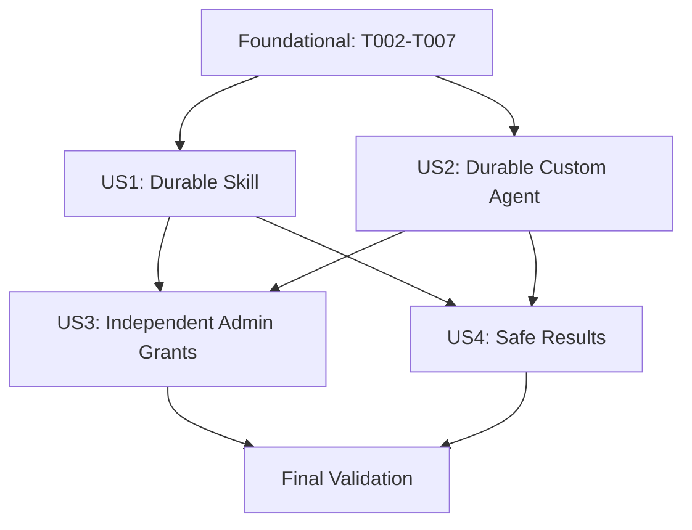

# Tasks: Agent Creation Tools

**Input**: Design documents from `/specs/014-agent-creation-tools/`
**Prerequisites**: `plan.md`, `spec.md`, `research.md`, `data-model.md`, `contracts/runtime-tools.md`, `contracts/management-api.md`, `quickstart.md`

**Tests**: Included. The specification and quickstart require focused backend, API, frontend, and Cosmos emulator coverage.

**Organization**: Tasks are dependency-ordered and grouped by user story. Backend modules are at the repository root, the React application is under `frontend/`, infrastructure is under `infra/`, and tests are under `tests/`.

## Format: `[ID] [P?] [Story] Description`

- **[P]**: Can run in parallel because it targets different files and does not depend on an incomplete task.
- **[Story]**: Required only in user-story phases and maps directly to `spec.md`.
- All paths are repository-root-relative.

---

## Phase 1: Setup

**Purpose**: Confirm the existing stack supports the implementation without dependency churn.

- [x] T001 Verify the existing Agent Framework, Pydantic, Azure Cosmos, pytest, Playwright, React, and TypeScript dependencies and test scripts in `pyproject.toml` and `frontend/package.json`; keep the no-new-dependency plan and use `uv` only for Python commands

---

## Phase 2: Foundational (Blocking Prerequisites)

**Purpose**: Establish atomic owner-scoped persistence, common creation contracts, and registry/validation boundaries required by every story.

**CRITICAL**: Complete this phase before implementing any user story.

- [x] T002 [P] Add failing atomic-create contract tests for same-owner duplicate preservation and same-id/different-owner success in `tests/test_user_data.py`
- [x] T003 Add `CosmosUserScopedRepository.create(user_id, item_id, data)` using Cosmos `create_item`, preserve the existing wrapper shape, and add the `AZURE_COSMOS_USER_SKILLS_CONTAINER`-backed `get_user_skills_repository()` singleton in `user_data.py`
- [x] T004 Update `InMemoryUserScopedRepository` with duplicate-safe `create`, reset/inject the user-skills singleton, and seed isolated repositories in `tests/_doubles.py` and `tests/conftest.py`
- [x] T005 [P] Define typed skill/agent creation requests, field-level validation issues, stable creation errors, and bounded created/error result models in `definition_creation.py`
- [x] T006 Introduce the explicit function-tool registry and exact-name factory lookup used by runtime construction without adding either creation tool to defaults in `app_context.py`
- [x] T007 Add strict-versus-session-compatible capability validation policy and owner-aware tool, skill, MCP server, and delegated-agent resolution entry points in `validators.py`

**Checkpoint**: Atomic create, test injection, typed outcomes, exact tool lookup, and strict validation policy are available to both P1 stories.

---

## Phase 3: User Story 1 - Create a Durable Skill Through an Agent (Priority: P1) MVP

**Goal**: An explicitly granted `create_skill` tool creates one durable, owner-isolated skill that is visible in the owner's combined catalog and loadable in later sessions.

**Independent Test**: Configure only `create_skill`, invoke it with a valid unique definition, verify the bounded success result and owner-only catalog/runtime resolution, then construct a fresh repository/session and read the unchanged full definition.

### Tests for User Story 1

- [x] T008 [P] [US1] Add failing skill creation service tests for validation, global/owner collisions, atomic persistence, durability through a fresh repository instance, and bounded results in `tests/test_definition_creation.py`
- [x] T009 [P] [US1] Add failing `create_skill` function-tool tests for owner-free input schema, immutable authenticated-user binding, exact grant behavior, and no content/owner leakage in `tests/test_creation_tools.py`
- [x] T010 [P] [US1] Add failing combined global-plus-owner catalog and cross-user list/get/collision tests in `tests/test_skills_manager.py`
- [x] T011 [P] [US1] Add failing owner-scoped selected-skill loading tests for parent and delegated agents in `tests/test_agent_factory.py`
- [x] T012 [P] [US1] Add failing authenticated `/api/skills` owner-catalog tests proving user-created skills are observable while global CRUD behavior and cross-user isolation remain unchanged in `tests/test_api.py`

### Implementation for User Story 1

- [x] T013 [US1] Expose reusable skill field validation and implement the global-plus-current-user catalog, deterministic resolution, and global-name reservation in `skills_manager.py`
- [x] T014 [US1] Implement `SkillCreationService` validation-before-write, timestamp/source normalization, duplicate mapping, and sanitized persistence handling in `definition_creation.py`
- [x] T015 [US1] Implement and register the owner-bound `create_skill` Agent Framework function factory with no owner parameter and the documented structured result contract in `tools.py` and `app_context.py`
- [x] T016 [US1] Change authenticated skill catalog reads to use the combined owner catalog while retaining established global administration write semantics in `api_routes/skills.py`
- [x] T017 [US1] Make `CosmosSkillsSource` and selected-skill providers resolve global plus bound-owner skills for parent and delegated agents, and thread immutable user identity through skill loading in `agent_factory.py` and `session_orchestration.py`
- [x] T018 [P] [US1] Declare the `/user_id`-partitioned `user-skills` container and wire its name through module outputs and App Service settings in `infra/modules/cosmos/main.tf`, `infra/modules/cosmos/variables.tf`, `infra/modules/cosmos/outputs.tf`, `infra/main.tf`, `infra/modules/app-service/main.tf`, and `infra/modules/app-service/variables.tf`
- [x] T019 [US1] Add emulator integration coverage for owner partition isolation, same-name/different-owner creation, fresh-repository durability, and `/user_id` partition behavior in `tests/test_user_data_cosmos.py`

**Checkpoint**: `create_skill` is independently grantable, durable, isolated, catalog-visible, and usable by a later owner session.

---

## Phase 4: User Story 2 - Create a Durable Custom Agent Through an Agent (Priority: P1)

**Goal**: An explicitly granted `create_agent` tool strictly validates and atomically creates a complete custom agent through the same business rules used by management writes.

**Independent Test**: Configure only `create_agent`, create a complete definition, verify owner-only persisted fields and structured success, then start the new agent in a fresh session; invalid or cross-user capability references must persist nothing.

### Tests for User Story 2

- [x] T020 [P] [US2] Add failing strict `AgentCreationService` tests for complete payload defaults, owner-scoped tools/skills/delegates, MCP safety, temperature, self/cycle rejection, atomic persistence, and fresh-session durability in `tests/test_definition_creation.py`
- [x] T021 [P] [US2] Add failing `create_agent` function-tool tests for the complete owner-free schema, immutable user binding, independent grant behavior, and bounded success output in `tests/test_creation_tools.py`
- [x] T022 [P] [US2] Add failing management API convergence tests for id/body matching, shared strict field issues, preserved `createdAt` on explicit updates, sanitized 503 responses, and owner isolation in `tests/test_user_data.py`
- [x] T023 [P] [US2] Add failing owner-aware delegated-agent and selected-skill resolution tests, including cross-user targets behaving as nonexistent and stale saved skills remaining session-compatible, in `tests/test_agent_factory.py` and `tests/test_session_orchestration.py`

### Implementation for User Story 2

- [x] T024 [US2] Implement `AgentCreationService` strict normalization, owner-scoped capability resolution, create-only persistence, and complete canonical custom-agent shape in `definition_creation.py`
- [x] T025 [US2] Refactor custom-agent validation to use the shared strict policy for creation/update while retaining tolerant stale-reference handling only for starting existing sessions in `validators.py` and `session_orchestration.py`
- [x] T026 [US2] Make `PUT /api/custom-agents/{agent_id}` delegate validation/normalization and update persistence to the shared creation business layer without calling a runtime tool or changing its successful wire shape in `api_routes/user_data.py`
- [x] T027 [US2] Resolve selected skills and delegated custom agents only from built-ins plus the authenticated owner's catalog when constructing new and saved custom agents in `agent_factory.py` and `session_orchestration.py`
- [x] T028 [US2] Implement and register the owner-bound `create_agent` Agent Framework function factory with the complete input schema and documented structured result contract in `tools.py` and `app_context.py`

**Checkpoint**: `create_agent` and the management route share strict business rules, while existing saved-agent session compatibility remains intact.

---

## Phase 5: User Story 3 - Administrators Control Each Creation Capability (Priority: P2)

**Goal**: `create_skill` and `create_agent` are separately discoverable in existing profile/custom-agent configuration UI and instantiated only for exact saved grants.

**Independent Test**: Save configurations with neither tool, each tool alone, and both; verify the builder shows two described choices and each resulting session's `tools_loaded` exactly matches the saved selection.

### Tests for User Story 3

- [x] T029 [P] [US3] Add failing API/runtime inventory tests for registry-backed discovery, stable descriptions, neither/either/both exact grants, missing-auth denial, and no implicit grants for existing definitions in `tests/test_api.py` and `tests/test_creation_tools.py`
- [x] T030 [P] [US3] Add focused Playwright UI tests that mock profile/tool APIs, verify both creation tools and descriptions are visible as separate options, and verify neither/either/both selections are preserved for custom agents and built-in overrides in `tests/test_agent_builder_ui.py`

### Implementation for User Story 3

- [x] T031 [US3] Source `GET /api/tools` and tool-health checks from the explicit registry so ungranted optional tools are advertised without scanning or changing `config/agents.yaml` defaults in `api_routes/profiles.py`
- [x] T032 [US3] Ensure the existing generic capability picker renders registry descriptions and preserves independent `create_skill`/`create_agent` selections through custom-agent and built-in-override save preparation in `frontend/src/pages/AgentBuilder.tsx`, `frontend/src/components/AgentCapabilityPicker.tsx`, and `frontend/src/hooks/useAgentBuilderForm.ts`

**Checkpoint**: Administrators can discover and independently grant both tools, and runtime availability exactly matches persisted configuration.

---

## Phase 6: User Story 4 - Receive Actionable, Non-Destructive Results (Priority: P2)

**Goal**: Both tools return stable, sanitized, retry-aware results and never overwrite or partially persist on expected failures or races.

**Independent Test**: Invoke each tool with valid, duplicate, invalid-reference, unauthorized, and simulated storage-failure inputs; verify exact envelopes and byte-for-byte preservation of existing definitions.

### Tests for User Story 4

- [x] T033 [P] [US4] Add parameterized contract tests for `created`, `validation_error`, `duplicate`, `unauthorized`, and `temporarily_unavailable` envelopes, required/omitted `issues`, retryability, and forbidden output/log fields in `tests/test_creation_tools.py`
- [x] T034 [P] [US4] Add service tests proving validation performs no write, duplicates preserve existing documents byte-for-byte, raw Cosmos/provider errors are sanitized, and interrupted-success retries become duplicates in `tests/test_definition_creation.py`
- [x] T035 [P] [US4] Add emulator concurrency tests proving exactly one same-owner/same-id create succeeds for both skills and custom agents, with the loser reported as duplicate and no overwrite, in `tests/test_user_data_cosmos.py`

### Implementation for User Story 4

- [x] T036 [US4] Centralize expected exception-to-result mapping and sanitized operational logging for both creation tools, exposing only kind, safe requested identity, stable code, and exception class in `definition_creation.py` and `tools.py`

**Checkpoint**: All expected outcomes are actionable, bounded, non-secret, and non-destructive under retries, failures, and concurrency.

---

## Phase 7: Polish & Cross-Cutting Concerns

**Purpose**: Document configuration and execute the complete validation matrix.

- [x] T037 [P] Document optional creation-tool grants, user-owned skill visibility, `AZURE_COSMOS_USER_SKILLS_CONTAINER`, no-overwrite behavior, and the focused Playwright command in `README.md`, `infra/README.md`, and `specs/014-agent-creation-tools/quickstart.md`
- [x] T038 Run focused backend verification from `specs/014-agent-creation-tools/quickstart.md` with `uv run pytest -q tests/test_creation_tools.py tests/test_definition_creation.py tests/test_user_data.py tests/test_skills_manager.py tests/test_agent_factory.py tests/test_session_orchestration.py tests/test_api.py`
- [x] T039 [P] Run frontend validation with `cd frontend && npm test && npm run lint && npm run build`, including the focused Playwright UI test command documented in `specs/014-agent-creation-tools/quickstart.md`
- [x] T040 [P] Run `terraform fmt -check -recursive` and `terraform validate` from `infra/` for the user-skills container and App Service setting wiring
- [x] T041 Run the full offline backend suite with `uv run pytest -q` and fix only regressions caused by feature 014
- [x] T042 Run the Cosmos emulator suite with `uv run pytest -q -m emulator` and verify atomic conflicts, partition isolation, fresh-repository durability, and `/user_id` container configuration
- [x] T043 Perform the manual neither/either/both runtime grant, owner catalog, restart, and second-user isolation checks from `specs/014-agent-creation-tools/quickstart.md`; run the existing Admin Agent Builder screenshot workflow only if `frontend/src/pages/AgentBuilder.tsx` or its layout changes

---

## Dependencies & Execution Order

### Phase Dependencies

- **Phase 1 (T001)**: No dependencies.
- **Phase 2 (T002-T007)**: Depends on Phase 1 and blocks every user story. T002 must fail before T003-T004; T005 and T006 can proceed in parallel with repository work; T007 follows the typed validation contracts in T005.
- **US1 (T008-T019)**: Depends on Phase 2. Tests T008-T012 are written first; T013 enables T014 and T016; T014 enables T015; T013 and T017 precede T019. T018 can run in parallel with backend work.
- **US2 (T020-T028)**: Depends on Phase 2. Tests T020-T023 are written first; T024-T025 precede route reuse T026 and runtime resolution T027; T024 precedes tool factory T028. US2 may proceed in parallel with US1 except where both touch `definition_creation.py`, `validators.py`, `agent_factory.py`, `session_orchestration.py`, or `app_context.py`.
- **US3 (T029-T032)**: Depends on T015 and T028 so both factories exist. T029-T030 are written first; T031 enables registry-backed UI inventory; T032 is required only to satisfy behavior exposed by the focused UI test and must not introduce defaults.
- **US4 (T033-T036)**: Depends on completed US1 and US2 service/tool paths. Write T033-T035 first, then centralize mappings in T036.
- **Polish (T037-T043)**: Depends on all selected user stories. T038 must pass before T041; T042 requires the emulator; T043 follows automated validation.

### User Story Completion Order



- **US1 and US2 are both P1** and can be developed concurrently after the foundation, coordinating shared files.
- **US3 depends on both registered factories** but remains independently testable with four saved grant combinations.
- **US4 hardens both creation paths** after their happy-path services and tools exist.

## Parallel Execution Examples

### User Story 1

```text
T008 service tests | T009 tool tests | T010 catalog tests | T011 factory tests | T012 API tests
T018 Terraform wiring can proceed in parallel with T013-T017 backend implementation
```

### User Story 2

```text
T020 service tests | T021 tool tests | T022 route tests | T023 orchestration tests
After T024-T025: T026 route reuse | T027 runtime resolution | T028 tool factory (coordinate shared imports)
```

### User Story 3

```text
T029 backend inventory/grant tests | T030 frontend Playwright tests
After both fail: T031 backend inventory | T032 existing builder integration
```

### User Story 4

```text
T033 result contract tests | T034 non-destructive service tests | T035 emulator concurrency tests
```

## Implementation Strategy

### MVP First

1. Complete Setup and Foundational phases.
2. Complete US1, including the owner catalog, runtime skill resolution, Terraform container, and focused tests.
3. Stop and validate US1 independently before adding custom-agent creation.

### Incremental Delivery

1. Foundation: atomic user-scoped create, shared contracts, strict policy, and exact registry.
2. US1: durable user skill creation and owner-scoped resolution.
3. US2: durable custom-agent creation and management-route convergence.
4. US3: registry-backed discoverability and exact frontend/profile grants.
5. US4: stable sanitized failure behavior and real Cosmos race coverage.
6. Polish: documentation, frontend/backend builds, Terraform validation, full offline suite, emulator suite, and manual checks.

## Notes

- Tests in each story are written first and must fail for the intended missing behavior before implementation begins.
- Runtime tools call shared Python services directly; they never invoke FastAPI routes.
- Management routes reuse shared validation/business services while retaining their established HTTP response shapes and explicit update semantics.
- Creation uses atomic repository `create`; management updates may continue to use `upsert` after strict validation.
- Owner identity comes only from authentication/session binding and never appears in a model-visible tool schema.
- Do not add `create_skill` or `create_agent` to `config/agents.yaml` or any default custom-agent form state.