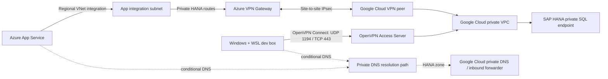

# Implementation Plan: SAP HANA Private Connectivity

**Branch**: `015-sap-hana-private-connectivity` | **Date**: 2026-07-27 | **Spec**: [spec.md](spec.md)
**Input**: Feature specification from `/specs/015-sap-hana-private-connectivity/spec.md`

## Summary

Restore a stable, read-only database tool surface and add SAP HANA behind a provider boundary.
Reach the privately addressed HANA service in Google Cloud from Azure App Service through regional
VNet integration and a highly available site-to-site IPsec VPN. Reach the same service from the
Windows/WSL development box with OpenVPN Connect and the supplied user-locked profile. Keep HANA
credentials separate from Azure identity, apply defense in depth with a
read-only HANA user and optional schema restriction, package the selected HANA client reproducibly, and release
the tools only after network, TLS, authorization, query-safety, and failover checks pass.

## Technical Context

**Language/Version**: Python 3.12.6; Terraform with AzureRM ~> 4.0; Google Cloud IaC language/repository to be confirmed with its network owner.  
**Primary Dependencies**: Existing FastAPI and Agent Framework runtime; one SAP HANA client selected by the driver spike (`hdbcli` or SAP HANA Client ODBC + existing `pyodbc`); no frontend dependency.  
**Data Source**: Private SAP HANA database in Google Cloud. Access defaults to objects readable by the least-privilege HANA identity and can be narrowed with an approved-schema override. Existing Cosmos application storage is unchanged.  
**Testing**: Offline `pytest` unit/contract tests, driver packaging smoke test, required-target HANA integration test that fails on missing/all-skipped configuration, HANA negative authorization tests, and tunnel failover exercise.  
**Target Platform**: Local Windows + WSL development and Linux Azure App Service in Azure Government; HANA hosted in a private Google Cloud VPC.  
**Project Type**: Existing two-tier web application deployed as one FastAPI/App Service unit.  
**Performance Goals**: Initial 10-second connection and 30-second query timeouts; p95 health/schema discovery in 10 seconds or less; p95 owner-approved representative bounded queries in 15 seconds or less; production redundant-tunnel recovery within 5 minutes; bounded row/cell/character materialization. Owners define expected volumes and approve or replace these values before implementation.  
**Constraints**: Read-only SQL; private routing only; non-overlapping CIDRs; TLS certificate validation; no credentials/query values/results in logs; HANA tools opt-in; Azure infrastructure in Terraform; `uv` only.  
**Scale/Scope**: One HANA endpoint initially, two model-facing database capabilities (approved metadata and read query), two access origins (Azure and workstation), one site-to-site IPsec path, and one user OpenVPN path.

## Current-State Findings

- `tools.py` retains SQL safety/formatting helpers and `pyodbc`, but current `main` no longer
  registers database query tools in `app_context.py`.
- Git history contains the former `SqlDatabase` implementation used by the SQL workflow. It mixed
  SQL Server authentication, `INFORMATION_SCHEMA`, `TOP`, bracket quoting, and OFFSET/FETCH behavior
  into one class. Those dialect assumptions cannot be copied directly to HANA.
- `README.md`, `.env.example`, Terraform, and the constitution still describe Azure SQL, while
  current agent profiles do not expose database tools. Documentation and runtime are therefore
  already inconsistent and must be reconciled as part of this work.
- No target Azure Synapse schema/tool contract or HANA endpoint details are checked into the
   repository or indexed session history. Exact Azure Synapse contract compatibility is a discovery
   gate, while continued support for both providers is required.
- Current Terraform has no VNet, delegated App Service integration subnet, Azure VPN Gateway, route,
  private DNS resolver, or Google Cloud network declaration.

## Target Architecture



The supplied profile is confidential, embeds private client material, is locked to one user, and
requires interactive credentials. It is appropriate only for workstation access and is ignored by
Git. Azure will use the separately offered site-to-site IPsec option through Azure VPN Gateway;
Phase 1 must obtain and validate the peer, cryptographic, routing, redundancy, and return-path
parameters. Public HANA access is not a fallback.

## Azure Terraform Resource Inventory

The deployed application needs the following new Azure infrastructure. The workstation OpenVPN
profile is not deployed to Azure and no OpenVPN VM/NVA is required.

| Resource | Terraform shape | Purpose |
|----------|-----------------|---------|
| Virtual network | `azurerm_virtual_network` | Private routing boundary for App Service and VPN Gateway; CIDR must not overlap any Google Cloud, OpenVPN client, office, or developer network. |
| App Service integration subnet | `azurerm_subnet` delegated to `Microsoft.Web/serverFarms` | Gives the existing Linux App Service private outbound access. Use a dedicated subnet sized for App Service scale; `/26` is the planning default. |
| Gateway subnet | `azurerm_subnet` named exactly `GatewaySubnet` | Hosts Azure VPN Gateway. Use a dedicated `/27` or larger subnet and do not attach an NSG. |
| VPN public IPs | `azurerm_public_ip` | Two static Standard public addresses for the production Azure IPsec peers. |
| Azure VPN Gateway | `azurerm_virtual_network_gateway` | Route-based site-to-site IPsec termination. Use an availability-zone SKU supported in the selected Azure Government region and an active-active production topology matched by the Google Cloud design; enable BGP only when both owners approve it. |
| Google Cloud peer definitions | One or more `azurerm_local_network_gateway` resources | Represents each Google Cloud VPN peer address, remote HANA/VPC prefixes, and optional BGP peer. |
| IPsec connections | One or more `azurerm_virtual_network_gateway_connection` resources | Establishes the site-to-site tunnels with the network-owner-provided IKE/IPsec policy and PSK. Redundant cloud peers may require multiple connections. |
| App Service VNet integration | `virtual_network_subnet_id` on `azurerm_linux_web_app` or `azurerm_app_service_virtual_network_swift_connection` | Connects the existing web app to the delegated integration subnet. Use one mechanism, not both. |
| VPN diagnostics | `azurerm_monitor_diagnostic_setting` plus an approved Log Analytics destination | Captures gateway, tunnel, route, and IKE diagnostics and supports tunnel-health alerts. |

### Routing

- Prefer routes learned/created by Azure VPN Gateway for the exact Google Cloud/HANA prefixes.
- Add an `azurerm_route_table` to the App Service integration subnet only if propagated gateway
   routes do not satisfy the final design. Do not force unrelated Azure or internet traffic through
   the VPN.
- Leave App Service route-all disabled initially. Private RFC1918/GCP routes should use VNet
   integration without rerouting all public dependencies; enable route-all only after testing Azure
   OpenAI, Search, Cosmos, Entra, deployment, and package-download paths.
- Google Cloud must have matching return routes for the App Service integration subnet and firewall
   rules permitting only that source prefix to the HANA SQL endpoint/port.

### Conditional Infrastructure

| Condition | Additional Terraform |
|-----------|----------------------|
| HANA uses a Google Cloud private DNS zone not resolvable from Azure | `azurerm_private_dns_resolver`, a dedicated outbound-endpoint subnet, `azurerm_private_dns_resolver_outbound_endpoint`, forwarding ruleset/rule, and VNet link targeting the Google Cloud DNS inbound-forwarder addresses. |
| HANA uses a stable private FQDN/IP and cross-cloud forwarding is temporarily unavailable | A narrowly scoped nonproduction-only `azurerm_private_dns_zone`, VNet link, and approved record with owner, expiry, authoritative-record comparison/alert, and enforced removal before production. |
| HANA uses password or certificate authentication | `azurerm_key_vault` and RBAC for the existing user-assigned managed identity. Seed secret/certificate values outside Terraform so they are not copied into source or ordinary outputs. |
| SAP HANA ODBC is selected and cannot be installed by App Service build | Azure Container Registry and a containerized App Service deployment containing the licensed SAP HANA client. These resources are unnecessary if `hdbcli` works in the existing Python deployment. |

### Secret and State Handling

Site-to-site IPsec normally uses a pre-shared key. When `shared_key` is supplied to
`azurerm_virtual_network_gateway_connection`, it is sensitive but still stored in Terraform state.
The deployment must therefore use an encrypted, access-controlled remote state backend and must not
export the PSK as a Terraform/azd output. HANA credentials likewise must not be Terraform-managed
secret values; Terraform should create Key Vault and permissions, while an authorized operator or
separate secret workflow loads and rotates the material.

### Repository Changes

```text
infra/
├── main.tf                         # Instantiate network and optional Key Vault modules.
├── variables.tf                    # CIDRs, peer/routing policy, DNS and feature inputs; PSK sensitive.
├── outputs.tf                      # Non-secret network diagnostics only; never output PSK/HANA secrets.
├── modules/network/                # VNet, subnets, VPN gateway, peer connections, routes, diagnostics.
├── modules/key-vault/              # Conditional vault and managed-identity RBAC.
└── modules/app-service/
      ├── main.tf                     # Add regional VNet integration and optional Key Vault references.
      └── variables.tf                # Accept integration subnet id and HANA non-secret settings.
```

Google Cloud VPN, Cloud Router/static routes, firewall, and DNS inbound forwarding remain external
deliverables in the Google Cloud owner's IaC system. Azure Terraform cannot complete the tunnel
until those peer parameters and resources exist.

## Constitution Check

| Principle | Status | Notes |
|-----------|--------|-------|
| I. Read-Only Data Access | PASS | Application validation plus a least-privilege HANA identity; bounded results remain mandatory. |
| II. Single-File Agent Definitions | PASS | Agent grants remain in `config/agents.yaml`; tool documentation remains in Python. |
| III. Security & Credential Hygiene | PASS WITH DESIGN ACTION | Traffic is private and TLS-validated. HANA does not natively inherit Azure managed identity, so the approved HANA credential/certificate must be held in Azure Key Vault via managed identity, with local credentials kept separately. |
| IV. Evaluation-Driven Quality | PASS WITH REQUIRED ACTION | Model-facing tool availability and behavior change. Restore/use the constitution's `eval/` pipeline, add database-tool cases, and block shared-environment promotion on regression even if prompts/models are unchanged. |
| V. Simplicity & Minimalism | PASS | One provider boundary restores the existing capabilities without a new service. Driver choice is deferred to a focused spike. |
| VI. Infrastructure as Code | PASS WITH EXTERNAL DEPENDENCY | Azure resources belong in this repo's Terraform. Google Cloud resources require approved IaC ownership before production. |
| VII. Two-Tier API-First Architecture | PASS | Database access stays exclusively in the FastAPI backend; no frontend or direct browser database path. |

**Pre-design gate**: PASS for planning. Implementation is blocked on DG-001 through DG-009 and
on resolving the constitution's Azure-only/database wording to acknowledge approved private SAP
HANA access and its non-managed-identity authentication boundary.

**Governance gate**: BLOCKED FOR IMPLEMENTATION. The current constitution names Azure
SQL/Synapse as the database stack and requires managed identity for production data access. Before
source or infrastructure implementation, complete a separate approved constitution amendment with
a version bump and Sync Impact Report that permits approved private non-Azure databases, requires
managed identity for Azure secret retrieval, and defines the least-privilege external database
credential exception. Regenerate/revalidate this plan after that amendment.

## Project Structure

```text
specs/015-sap-hana-private-connectivity/
├── spec.md
├── plan.md
├── research.md
├── data-model.md
├── quickstart.md
├── contracts/
│   ├── database-tools.md
│   └── network-security-handoff.md
└── tasks.md

database.py                 # Shared provider protocol, validation, result bounding, errors.
database_hana.py            # HANA connection, metadata, quoting/pagination, diagnostics.
database_synapse.py         # Preserve existing Azure Synapse/SQL Server behavior as a provider.
tools.py                    # Thin model-facing database tool factories and shared sanitization.
app_context.py              # Register database tools and build configured provider instances.
config/agents.yaml          # Opt-in grants only after target-environment acceptance.
infra/
├── modules/network/        # VNet, subnets, VPN gateway/connections, routes, DNS components.
├── modules/app-service/    # Regional VNet integration, route-all, Key Vault references/settings.
└── ...                     # Existing resources remain intact.
scripts/
└── verify_hana_connectivity.py  # Layered DNS/TCP/TLS/auth/query smoke checks; no secrets printed.
tests/
├── test_database_validation.py
├── test_database_hana.py
├── test_database_tools.py
└── test_hana_integration.py
```

**Structure Decision**: Keep the model-facing tools in `tools.py`, but move database behavior out
of that already broad module. Use a small provider protocol because SQL Server and HANA differ in
authentication, metadata catalogs, quoting, limiting/pagination, and error codes. Do not add a
generic ORM or a database administration layer.

## Design Artifacts

- [data-model.md](data-model.md) defines provider configuration, grants, requests/results,
   deterministic continuation, environment acceptance, and invalidation transitions.
- [contracts/database-tools.md](contracts/database-tools.md) proposes the stable model-facing tool
   schemas, provider binding, accepted SQL grammar, serialization, errors, authorization, and
   Azure Synapse compatibility gate.
- [contracts/network-security-handoff.md](contracts/network-security-handoff.md) is the blocking
   parameter/evidence contract for OpenVPN, site-to-site IPsec, DNS, HANA identity, Key Vault, and
   protected Terraform state.

## Delivery Phases

### Phase 0 - Ownership and Inputs

Resolve every discovery gate in [spec.md](spec.md). Produce an address plan, endpoint/TLS sheet,
Azure Synapse compatibility examples, security owner list, and separate local/production credential plan.
No cloud resources or driver code should be built against guessed values.

Approve the database tool contract and Azure Synapse compatibility fixtures. Confirm whether any
single agent needs both providers; if so, approve unambiguous tool aliases. Approve the initial
10-second connection timeout, 30-second query timeout, p95 health/schema and representative-query
targets, expected result volumes, and 5-minute production redundant-tunnel recovery target or record
replacements. Complete the separate constitution amendment and verify the Terraform state backend
before any implementation task begins.

### Phase 1 - Network Proof

1. Allocate non-overlapping Azure VNet, gateway, App Service integration, OpenVPN tunnel
   pool, and Google Cloud VPC ranges.
2. Obtain the site-to-site IPsec peer addresses, IKE/IPsec policy, authentication exchange process,
   local/remote prefixes, BGP or static-routing parameters, DPD/rekey settings, and redundancy model.
3. Build a highly available route-based Azure VPN Gateway in this repository and matching Google
   Cloud VPN connections in the owning IaC system using the agreed IPsec parameters. Keep pre-shared
   keys in an approved secret workflow and out of source control and Terraform outputs.
4. Advertise or configure only required routes/firewall rules for the App integration subnet to the
   exact HANA destination/port, with deterministic Google Cloud return routes.
5. Configure App Service regional VNet integration and UDRs for the HANA private prefixes through
   Azure VPN Gateway; review whether route-all is required before enabling it.
6. Import the user-locked profile into OpenVPN Connect on Windows and prove WSL route/DNS
   propagation without copying credentials or private profile contents into scripts or logs.
7. Prove the Azure site-to-site tunnel from a VNet workload, including negotiated policy, routing,
   deterministic return traffic, DPD/rekey behavior, and redundant-tunnel failover.
8. Prove private DNS. Prefer conditional forwarding with Azure DNS Private Resolver to a Google
   Cloud DNS inbound forwarding path; permit a narrowly scoped Azure private-zone record only in
   nonproduction with owner, expiry, authoritative-record comparison/alert, and a removal gate
   before production.

**Exit gate**: WSL and a VNet test workload resolve the private name and establish TLS to HANA;
disconnecting OpenVPN removes workstation reachability; IPsec tunnel failover/recovery meets the
agreed Azure availability target without public fallback.

### Phase 2 - Driver and Authentication Spike

Test `hdbcli` and SAP HANA Client ODBC against the actual HANA version and auth policy. Compare:

- Python 3.12/Linux compatibility and `uv` installation.
- TLS hostname/CA configuration and supported authentication.
- Parameter binding, metadata APIs, error classification, cancellation, and fetch limiting.
- Reproducible Azure App Service packaging. ODBC likely requires a custom container containing
  SAP HANA Client; a pure Python-wheel deployment is preferable only if it meets security and
  operational requirements.
- License/distribution constraints for the SAP client.

After Phase 1 establishes both reachable paths, create a disposable read-only spike identity and
test both clients against the same target. Select one client and record the decision. Create the
long-lived HANA technical user with catalog and data
permissions restricted to approved objects. Store production secret/certificate material in Key
Vault and let the App Service identity retrieve it; do not place the credential in Terraform state
or azd environment output.

**Exit gate**: both WSL and an Azure test workload run `SELECT CURRENT_TIMESTAMP FROM DUMMY` with
TLS validation, and direct write/DDL attempts fail under the HANA identity.

### Phase 3 - Application Integration

1. Preserve the confirmed Azure Synapse tool contract through a provider-neutral service.
2. Implement AST/token-aware single-statement read validation appropriate for HANA; do not rely
   only on a `startswith("SELECT")` check.
3. Implement HANA metadata discovery from approved catalog views without exposing unrelated
   schemas, source definitions, or unbounded samples.
4. Apply HANA quoting and limiting semantics within the provider, keeping tool output stable.
5. Use short connection acquisition, query, and fetch timeouts; classify network/TLS/authz/query
   failures into sanitized messages and retain detailed server-side diagnostics without secrets.
6. Register the tools as optional capabilities and add provider configuration validation at
   startup/inventory time without opening a database connection for agents that do not use them.
7. Require both environment-specific entitled Entra-group membership and an agent/provider grant;
   audit the application user separately from the shared HANA technical identity.
8. Use stable keyset continuation for ordered results. Mark unordered truncation as partial and
   require a narrower ordered query instead of implying complete coverage.

**Exit gate**: offline contract tests pass; target integration tests prove metadata, bounded reads,
negative SQL validation, HANA permission denial, entitlement denial, deterministic continuation,
truncation, redaction, and disabled-tool behavior. The required-target command fails if its
configuration is missing or every HANA integration test skips.

### Phase 4 - Production Hardening and Rollout

Add OpenVPN client and site-to-site IPsec tunnel health checks, HANA connection/query latency telemetry, failure classification,
credential-expiry monitoring, and an operations runbook. Test tunnel failover, DNS failure,
credential rotation, disabled feature rollback, and App Service restart/scale behavior. Provision
production with HANA disabled and repeat production required-target, redundant-peer failover, and
evaluation checks before production approval. Enable the
tools only after a signed, current nonproduction acceptance manifest exists. Run the constitution's
evaluation pipeline with database-tool cases, enable one nonproduction agent/group, run representative
Azure Synapse comparison queries, and then produce a separate signed production acceptance manifest
before promotion.

## Key Risks

| Risk | Mitigation / Decision Gate |
|------|----------------------------|
| Site-to-site IPsec parameters or Google Cloud return routes are incomplete | Treat the network-owner handoff as a hard gate before provisioning or application integration. |
| User-locked OpenVPN profile is copied into Azure or source control | Keep it workstation-only, ignored by Git, and use site-to-site IPsec for Azure. |
| Overlapping Azure/GCP/OpenVPN CIDRs | Address-plan review is a hard prerequisite; use gateway source NAT only when required and explicitly documented. |
| App Service cannot package the SAP ODBC client | Driver spike; use a custom container only if required and license-approved. |
| HANA SQL differs from SQL Server assumptions | Provider-specific metadata, quoting, limiting, and pagination with contract tests. |
| Credential handling violates managed-identity expectations | Managed identity retrieves Key Vault material; HANA receives its own least-privilege credential. Document the boundary. |
| VPN PSK is hidden in output but exposed through Terraform state | Verify the protected remote backend and rotation process before VPN provisioning; never output the PSK. |
| Private DNS creates split-horizon or stale records | Conditional forwarding with explicit zone ownership and health checks. |
| A validator bypass permits writes | HANA grants deny writes; application validator and negative tests provide additional controls. |
| Shared HANA identity bypasses per-user authorization | Require entitled Entra-group membership plus agent/provider grants and audit the application user. |
| Truncation is mistaken for complete data | Use bounded fetch, stable keyset continuation, and explicit partial-result guidance for unordered queries. |
| Integration tests pass by skipping the target | Required-target mode fails on missing configuration or an all-skip run. |
| Cross-cloud egress/HA VPN cost or latency is unacceptable | Measure during network proof and record baseline/cost before full build. |

## Complexity Tracking

No constitution violation is accepted. Cross-cloud networking and a database provider boundary are
required by the stated hosting topology and HANA dialect; neither adds a new application tier.
