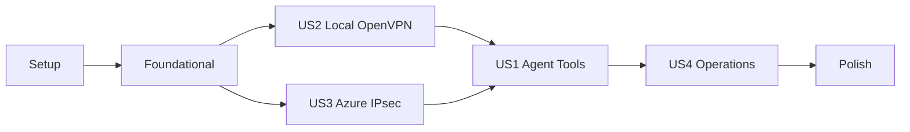

# Tasks: SAP HANA Private Connectivity

**Input**: Design documents from `/specs/015-sap-hana-private-connectivity/`
**Prerequisites**: `plan.md`, `spec.md`, `research.md`, `data-model.md`, `contracts/`, `quickstart.md`

**Tests**: Required by the feature specification. Write each story's tests first and confirm they fail for the expected reason before implementation.

**Organization**: Tasks are grouped by user story. US2 and US3 precede US1 because all three are P1 and the HANA provider decision requires both private connectivity paths.

## Phase 1: Setup - Governance and Planning Gates

**Purpose**: Resolve repository governance and establish the protected deployment boundary before implementation.

- [ ] T001 Amend `.specify/memory/constitution.md` with a version bump and Sync Impact Report permitting approved private non-Azure databases while retaining managed identity for Azure secret retrieval
- [ ] T002 Update the constitution check and governance gate in `specs/015-sap-hana-private-connectivity/plan.md` after T001 is approved
- [ ] T003 Document and verify Terraform state encryption, RBAC, locking, retention, audit, recovery, and PSK rotation controls in `specs/015-sap-hana-private-connectivity/contracts/network-security-handoff.md`
- [ ] T004 Create the acceptance artifact directory and add a redacted signed-envelope example in `specs/015-sap-hana-private-connectivity/acceptance/example.json`

**Checkpoint**: T001-T003 are hard gates; do not begin Foundational or implementation work until all three pass.

---

## Phase 2: Foundational - Contracts, Owners, and Target Inputs

**Purpose**: Resolve discovery gates and shared contracts that block every user story.

**CRITICAL**: No user story implementation begins until this phase is complete.

- [ ] T005 Complete HANA version, topology, endpoint, TLS, authentication, grants, rotation, classification, and owner fields in `specs/015-sap-hana-private-connectivity/contracts/network-security-handoff.md`
- [ ] T006 Complete IPsec peers, IKE/IPsec policy, authentication exchange, prefixes, routing, DPD/rekey, redundancy, firewall, return-route, and DNS fields in `specs/015-sap-hana-private-connectivity/contracts/network-security-handoff.md`
- [ ] T007 Record the approved non-overlapping Azure, App integration, `GatewaySubnet`, OpenVPN, office/developer, and Google Cloud CIDRs in `specs/015-sap-hana-private-connectivity/contracts/network-security-handoff.md`
- [ ] T008 Record the exact Google Cloud IaC repository/path, accountable owner, delivery workflow, and evidence link format in `specs/015-sap-hana-private-connectivity/contracts/network-security-handoff.md`
- [ ] T009 Record HANA OpenVPN routes, pushed DNS, contractual client pool, split tunneling, profile rotation/revocation, and concurrent-session policy in `specs/015-sap-hana-private-connectivity/contracts/network-security-handoff.md`
- [ ] T010 [P] Record representative workloads, expected result volumes, timeout/latency/recovery thresholds, monitoring owner, and escalation path in `specs/015-sap-hana-private-connectivity/plan.md`
- [ ] T011 [P] Record configured Entra tenants, environment group object IDs, transitive-membership policy, and data-suitability approval in `specs/015-sap-hana-private-connectivity/data-model.md`
- [ ] T012 [P] Recover sanitized historical Azure Synapse requests and results into `tests/fixtures/database_contract/synapse/`
- [ ] T013 Approve tool names, provider aliases, request/result schemas, SQL grammar, errors, audit fields, and continuation semantics in `specs/015-sap-hana-private-connectivity/contracts/database-tools.md`
- [ ] T014 Document the offline `hdbcli` and SAP HANA Client ODBC licensing, Python 3.12 packaging, and same-target spike matrix in `specs/015-sap-hana-private-connectivity/research.md`

**Checkpoint**: DG-001 through DG-009 are resolved, contracts are approved, and no production value is guessed.

---

## Phase 3: User Story 2 - Develop Locally Over Private Networking (Priority: P1)

**Goal**: Let a Windows/WSL developer reach the private HANA endpoint through the confidential OpenVPN profile using developer-scoped credentials.

**Independent Test**: Connect OpenVPN, resolve the private FQDN from WSL, validate TCP/TLS and a read-only health query, disconnect and prove loss of reachability, then reconnect and repeat successfully.

### Tests for User Story 2

- [ ] T015 [P] [US2] Add failing secret-safe DNS, TCP, TLS, authentication, and health-probe tests in `tests/test_hana_connectivity.py`
- [ ] T016 [P] [US2] Add failing local configuration redaction and missing-secret behavior tests in `tests/test_database_hana.py`

### Implementation for User Story 2

- [ ] T017 [US2] Preserve `ovpn/*.ovpn` exclusion and document owner-only profile handling without credentials in `.gitignore` and `specs/015-sap-hana-private-connectivity/quickstart.md`
- [ ] T018 [US2] Implement metadata-only layered DNS, TCP, TLS, authentication, and health checks with no credential arguments in `scripts/verify_hana_connectivity.py`
- [ ] T019 [US2] Create the developer-scoped read-only HANA identity and record sanitized grant-denial evidence in `specs/015-sap-hana-private-connectivity/acceptance/development.json`
- [ ] T020 [US2] Run the OpenVPN disconnect/reconnect verification with an owner-approved temporary client and attach protected evidence references and digests to `specs/015-sap-hana-private-connectivity/acceptance/development.json`

**Checkpoint**: WSL reaches HANA only while OpenVPN is connected, validates the certificate hostname, and runs the bounded health query without leaking credentials.

---

## Phase 4: User Story 3 - Reach HANA From Azure Hosting (Priority: P1)

**Goal**: Route Azure App Service privately to HANA through VNet integration and redundant site-to-site IPsec without public fallback or an App Service VPN client.

**Independent Test**: From the deployed VNet-integrated runtime, resolve the private HANA FQDN, establish TLS, run a health query with an approved temporary client, verify the route uses Azure VPN Gateway, and prove failover without public fallback.

### Tests for User Story 3

- [ ] T021 [P] [US3] Add failing Terraform assertions for delegated integration subnet, `GatewaySubnet`, active-active route-based VPN, least-privilege prefixes, no default route, and no secret outputs in `tests/infra/test_network_plan.py`
- [ ] T022 [P] [US3] Add failing Terraform assertions for App Service VNet integration, Key Vault references, HANA-disabled defaults, and no embedded OpenVPN client in `tests/infra/test_app_service_plan.py`
- [ ] T023 [P] [US3] Add failing deployed DNS, TCP, TLS, health-query, route-source, tunnel-failure, and no-public-fallback tests in `tests/test_hana_network_integration.py`

### Implementation for User Story 3

- [ ] T024 [US3] Implement VNet, delegated `/26` integration subnet, `/27+` `GatewaySubnet`, active-active VPN Gateway, peer connections, optional BGP, least-privilege routing, and non-secret outputs in `infra/modules/network/main.tf`, `infra/modules/network/variables.tf`, and `infra/modules/network/outputs.tf`
- [ ] T025 [P] [US3] Implement matching Google Cloud VPN peers, return routing, firewall, logging, and DNS forwarding in the T008-approved repository and link evidence in `specs/015-sap-hana-private-connectivity/contracts/network-security-handoff.md`
- [ ] T026 [US3] Wire network inputs and non-secret outputs through `infra/main.tf`, `infra/variables.tf`, `infra/main.tfvars.json`, `infra/outputs.tf`, and `azure.yaml`
- [ ] T027 [US3] Add one App Service regional VNet integration mechanism with route-all disabled initially in `infra/modules/app-service/main.tf` and `infra/modules/app-service/variables.tf`
- [ ] T028 [US3] Implement Azure DNS Private Resolver forwarding or the expiring nonproduction fallback with authoritative comparison and production removal gate in `infra/modules/network/main.tf`
- [ ] T029 [US3] Implement Key Vault, HANA secret/certificate references, versioned RSA acceptance key, managed-identity reader access, and separate CI signer permissions in `infra/modules/key-vault/main.tf`, `infra/modules/key-vault/variables.tf`, and `infra/modules/key-vault/outputs.tf`
- [ ] T030 [US3] Implement the ephemeral PSK plan/apply, redaction, cleanup, artifact, state-recovery, rotation, and rollback workflow in `scripts/apply_network.sh`
- [ ] T031 [US3] Load disposable spike credential/certificate material through the approved out-of-band workflow and record only URI/expiry metadata in `specs/015-sap-hana-private-connectivity/contracts/network-security-handoff.md`
- [ ] T032 [US3] Run approved Terraform validation and nonproduction plans from `infra/`, then obtain Azure and Google Cloud owner approval in `specs/015-sap-hana-private-connectivity/acceptance/development.json`
- [ ] T033 [US3] Apply nonproduction networking only through `scripts/apply_network.sh` and attach route, tunnel, DNS, cleanup, and redaction evidence to `specs/015-sap-hana-private-connectivity/acceptance/development.json`
- [ ] T034 [US3] Run deployed DNS, TCP, TLS, health, route-source, failover, and no-public-fallback checks in `tests/test_hana_network_integration.py`

**Checkpoint**: The deployed route domain reaches HANA through private DNS and redundant IPsec, and the same endpoint remains unreachable through public fallback.

---

## Phase 5: User Story 1 - Query HANA Through Existing Agent Tools (Priority: P1) - MVP

**Goal**: Restore the Azure Synapse database experience and add provider-bound HANA schema/query capabilities with read-only enforcement, bounded results, safe continuation, and per-user authorization.

**Independent Test**: With a HANA-enabled test agent, discover one readable object, execute a bounded ordered `SELECT`, continue safely, narrow access with an approved-schema override, and prove unsafe SQL and unauthorized users are denied while Synapse remains independently available.

### Tests for User Story 1

- [X] T035 [P] [US1] Add failing request-schema, scalar-boundary, SQL grammar, schema-override, and unsafe-statement tests in `tests/test_database_validation.py`
- [X] T036 [P] [US1] Add failing provider-contract, normalized serialization, truncation, and error-category tests in `tests/test_database_tools.py`
- [X] T037 [P] [US1] Add failing Synapse compatibility tests backed by `tests/fixtures/database_contract/synapse/` in `tests/test_database_synapse.py`
- [ ] T038 [P] [US1] Add failing HANA metadata, quoting, TLS, parameter, cancellation, bounded-fetch, and grant-denial tests in `tests/test_database_hana.py`
- [ ] T039 [P] [US1] Add failing tenant, group-overage, Graph-resolution, revocation, provider-grant, complete audit-event, denial, pre-execution, and redaction tests in `tests/test_database_authorization.py`
- [X] T040 [P] [US1] Add failing signed-continuation binding, replay, tamper, expiry, key-ordering, advancement, and partial-result tests in `tests/test_database_continuation.py`
- [X] T041 [P] [US1] Add failing simultaneous Synapse/HANA registration, independent grant selection, and contract-regression tests in `tests/test_database_coexistence.py`
- [ ] T042 [P] [US1] Register `hana_integration` and add failing required-target tests for HANA query behavior, Entra allow/deny/revocation, provider grants, audit fields/redaction, and approved p95 workloads in `pyproject.toml`, `tests/conftest.py`, and `tests/test_hana_integration.py`

### Implementation for User Story 1

- [ ] T043 [US1] Run the T014 matrix for both clients from WSL and the deployed route domain, select one driver, record measured behavior in `specs/015-sap-hana-private-connectivity/research.md`, and revoke the disposable identity
- [ ] T044 [US1] If `hdbcli` wins T043, add it with `uv` to `pyproject.toml` and `uv.lock` and preserve target driver tests in `tests/test_database_hana.py`
- [ ] T045 [US1] If ODBC wins T043, add licensed client installation to `infra/modules/app-service/Dockerfile.hana-odbc`, registry resources to `infra/modules/container-registry/main.tf`, root wiring to `infra/main.tf`, App Service image/managed-identity registry configuration to `infra/modules/app-service/main.tf`, and plan/image assertions to `tests/test_hana_odbc_image.py`; do not execute T044
- [ ] T046 [US1] Create the long-lived development read-only HANA identity, exact catalog/data grants, rotation ownership, and direct write/DDL/procedure denial evidence in `specs/015-sap-hana-private-connectivity/acceptance/development.json`
- [X] T047 [US1] Implement provider configuration, grants, request/result models, sanitized errors, limits, continuation claims, and acceptance-policy protocol in `database.py`
- [X] T048 [P] [US1] Restore the Azure Synapse provider and Azure AD token behavior in `database_synapse.py`
- [ ] T049 [P] [US1] Implement HANA connection lifecycle, TLS, catalogs, quoting, parameters, serialization, bounded fetch, and error mapping with the selected driver in `database_hana.py`
- [X] T050 [US1] Implement HANA-aware single-read-statement parsing and approved-schema narrowing in `database.py`
- [X] T051 [US1] Implement RFC 8785 parameter hashing and signed keyset continuation in `database.py`
- [X] T052 [US1] Add provider-bound `database_schema` and `database_query` factories without SQL, parameter, or result logging in `tools.py`
- [X] T053 [US1] Register simultaneous optional providers and enforce independent provider grants in `app_context.py`
- [X] T054 [US1] Enforce configured tenant, transitive entitled-group membership, five-minute maximum cache, revocation, provider grant, and metadata-only audit events in `session_orchestration.py`
- [ ] T055 [US1] Add least-privilege Microsoft Graph permissions only when group-overage resolution requires them in `infra/modules/app-service/main.tf`
- [ ] T056 [US1] Add selected-driver HANA settings, Key Vault references, and `HANA_ENABLED=false` to `infra/modules/app-service/main.tf` and `infra/modules/app-service/variables.tf`
- [ ] T057 [US1] Add HANA-disabled local defaults and non-secret provider configuration guidance in `.env.example` and `README.md`
- [ ] T058 [US1] Run the required-target suite with a positive executed-test count and attach query, Entra authorization, audit, p95 health/schema/query, expected-volume, and write-denial evidence to `specs/015-sap-hana-private-connectivity/acceptance/development.json`

**Checkpoint**: US1 is complete after US2 and US3 provide the target paths; Synapse and HANA coexist, all unsafe/unauthorized operations fail, limits and continuation are truthful, and approved performance targets pass.

---

## Phase 6: User Story 4 - Operate and Audit the Integration (Priority: P2)

**Goal**: Provide sanitized diagnostics, application/database metrics, network monitoring, signed acceptance, failover validation, and reversible rollout.

**Independent Test**: Trigger DNS, route, port, certificate, authentication, authorization, SQL, timeout, and truncation failures; verify exact sanitized categories, complete audit metadata, metrics/alerts, acceptance invalidation, and disable-switch rollback.

### Tests for User Story 4

- [ ] T059 [P] [US4] Add RFC 8785 conformance, RS256 tamper/signature/key/algorithm/retrieval, schema/status/environment/fingerprint, freshness, evidence, and role-approval tests in `tests/test_acceptance_manifest.py`
- [ ] T060 [P] [US4] Add VPN diagnostics, alert, retention, action-group, and production redundancy assertions in `tests/infra/test_network_monitoring_plan.py`
- [ ] T061 [P] [US4] Add application connection-health, query-duration, failure-category, credential-expiry, and approved-threshold telemetry tests in `tests/test_database_observability.py`

### Implementation for User Story 4

- [ ] T062 [US4] Add VPN/IKE diagnostics, Log Analytics retention, action group, tunnel-down alerts, and approved recovery thresholds in `infra/modules/network/main.tf`
- [ ] T063 [US4] Add connection-health, query-duration, failure-category, timeout, and credential-expiry metrics and alerts in `database.py` and `infra/modules/app-service/main.tf`
- [ ] T064 [US4] Implement RFC 8785 canonicalization, Key Vault RS256 signing, managed-identity verification, fingerprint invalidation, and fail-closed acceptance policy in `acceptance.py`
- [ ] T065 [US4] Add database-tool evaluation cases and scoring expectations in `eval/datasets/database_tools.jsonl`
- [ ] T066 [US4] Restore or document trace generation, deterministic and AI-judge scoring, Foundry upload, and regression blocking in `eval/README.md`
- [ ] T067 [US4] Produce the signed nonproduction acceptance envelope with typed evidence and role approvals in `specs/015-sap-hana-private-connectivity/acceptance/development.json`
- [ ] T068 [US4] Enable one entitled nonproduction agent and provider grant in `config/agents.yaml`, then verify disable-switch rollback without removing network infrastructure
- [ ] T069 [US4] Exercise redundant tunnel failover, DNS/port/trust/auth/query failures, credential rotation, App Service restart/scale, metrics, alerts, and rollback; update `specs/015-sap-hana-private-connectivity/acceptance/development.json`
- [ ] T070 [US4] Provision production with `HANA_ENABLED=false`, create the production read-only identity and direct write/DDL/procedure denial evidence, and run required-target, evaluation, p95 workload, actual redundant-peer failover, rotation, observability, and rollback checks using `specs/015-sap-hana-private-connectivity/acceptance/production.json`
- [ ] T071 [US4] Sign and verify the production acceptance envelope and enable the production grant only while signature, status, freshness, evidence, and fingerprint remain valid in `specs/015-sap-hana-private-connectivity/acceptance/production.json` and `config/agents.yaml`

**Checkpoint**: Operators can diagnose failures without sensitive data, acceptance invalidates on controlled changes, and production remains disabled until every signed gate passes.

---

## Phase 7: Polish and Cross-Cutting Validation

**Purpose**: Validate all stories together and finalize maintainable documentation.

- [ ] T072 [P] Reconcile provider, VPN, secret, rotation, monitoring, and rollback documentation in `README.md`
- [ ] T073 [P] Update executable verification and release commands in `specs/015-sap-hana-private-connectivity/quickstart.md`
- [ ] T074 Run offline database, authorization, acceptance, observability, and infrastructure suites from `tests/`
- [ ] T075 Run `HANA_INTEGRATION_REQUIRED=true` against each target environment using `tests/test_hana_integration.py`
- [ ] T076 Run the full backend suite from `tests/`, then run `npm test` and `npm run build` from `frontend/package.json`
- [ ] T077 Run the database-tool evaluation pipeline documented in `eval/README.md` and block any regression
- [ ] T078 Run `terraform -chdir=infra fmt -check`, `terraform -chdir=infra validate`, and approved environment plans from `infra/`
- [ ] T079 Re-run `specs/015-sap-hana-private-connectivity/quickstart.md` end to end and attach final evidence references to both acceptance manifests

---

## Dependencies and Execution Order

### Phase Dependencies

- **Setup (Phase 1)**: Starts immediately; T001, T002, and T003 block every later phase.
- **Foundational (Phase 2)**: Depends on Setup approval; blocks every user story.
- **US2 (Phase 3)**: Depends on Foundational; can proceed in parallel with US3.
- **US3 (Phase 4)**: Depends on Foundational; can proceed in parallel with US2.
- **US1 (Phase 5)**: Depends on US2 and US3 connectivity checkpoints because driver selection requires both target paths.
- **US4 (Phase 6)**: Depends on US1, US2, and US3 checkpoints.
- **Polish (Phase 7)**: Depends on all selected user stories.

### User Story Dependency Graph



### Parallel Opportunities

- T010-T012 collect independent targets, groups, and Synapse fixtures in parallel after T005-T009.
- US2 and US3 proceed in parallel after Foundational.
- T035-T042 define independent US1 test surfaces before implementation.
- T048 and T049 implement separate provider modules in parallel after T047 and driver selection.
- T059-T061 cover independent acceptance, network, and application observability tests.
- T072 and T073 update independent documentation files in parallel.

## Parallel Execution Examples

### User Story 2

```text
Task T015: tests/test_hana_connectivity.py
Task T016: tests/test_database_hana.py
```

### User Story 3

```text
Task T021: tests/infra/test_network_plan.py
Task T022: tests/infra/test_app_service_plan.py
Task T023: tests/test_hana_network_integration.py
```

### User Story 1

```text
Task T035: tests/test_database_validation.py
Task T036: tests/test_database_tools.py
Task T037: tests/test_database_synapse.py
Task T038: tests/test_database_hana.py
Task T039: tests/test_database_authorization.py
Task T040: tests/test_database_continuation.py
Task T041: tests/test_database_coexistence.py
Task T042: tests/test_hana_integration.py
```

### User Story 4

```text
Task T059: tests/test_acceptance_manifest.py
Task T060: tests/infra/test_network_monitoring_plan.py
Task T061: tests/test_database_observability.py
```

## Implementation Strategy

### MVP Scope

The deployable nonproduction MVP is **US2 + US3 + US1 + the US4 acceptance subset T059 and T064-T068**. US1 is the product capability, US2 and US3 are equal-priority connectivity prerequisites, and the acceptance subset is required before an agent can be enabled.

1. Complete Setup and Foundational gates.
2. Prove US2 and US3 private connectivity in parallel.
3. Complete US1 provider selection, implementation, authorization, and required-target validation.
4. Complete T059 and T064-T068 for signed nonproduction acceptance, mandatory evaluation, and one-agent enablement.
5. Stop and validate bounded read-only agent queries before the remaining US4 production operations.

### Incremental Delivery

1. Setup + Foundational establish approved contracts and owner inputs.
2. US2 proves the local developer path.
3. US3 proves the Azure private path.
4. US1 selects the driver and enables provider-bound tools only after both paths pass.
5. US4 adds monitoring, signed acceptance, evaluations, and production rollout.

### Stop Conditions

- Do not implement before the constitution amendment, plan revalidation, and protected Terraform state gate pass.
- Do not provision networking before IPsec/DNS inputs, Google Cloud ownership, and non-overlapping CIDRs are approved.
- Do not choose the HANA driver before both clients run against the same target from WSL and Azure.
- Do not expose HANA tools when required-target tests skip, authorization/audit checks fail, or acceptance verification fails.
- Do not enable production before actual production p95, redundant-peer, rotation, observability, and rollback evidence is signed.